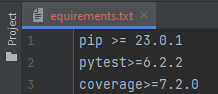
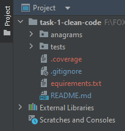

# Instalation

---

## Development
* install <a href="https://www.python.org/ftp/python/3.11.2/python-3.11.2-amd64.exe"> Python 3.8.0. </a>
* run `pip install requirements.txt`




## Launching

---

### Local
* run `python anagrams_unit_tests`
* run `python rev_function`
### Links
* <a href='https://coverage.readthedocs.io/en/7.2.0/'> Coverage </a> -   coverage documentation
* <a href='https://docs.python.org/3/library/unittest.html'> Unittest </a> -   unittest documentation

---

## For short example 🙂
* ### We have one unittest file `python func_reverse`
0. `import unittest` `from anagrams.func_reverse import rev_text` - import unittest library and main function of work file
1. `class TestStringReverse(unittest.TestCase):` - one class in file where we use unittest
2. `def test_typical_string_symbol(self):` - once function where we test typical input like symbol with string
3. `def test_atypical_only_symbol(self):` - twice function is test of atypical with only symbol


* ### We have work file `python anagrams_unit_test`
1. `def rev_text(text)` - once function in file where we get input string and we break it into parts, after we send it in next function
2. `def test_atypical_only_symbol(self):` - twice function where we do main work with create return string to once function 
---

## Instruction for using unit test 🙈
`Use coverage run to run your test suite and gather data`
* `python anagrams_unit_test`
* `$ coverage run -m unittest discover`
* `$ coverage report -m` - to report on the results:
* `$ coverage html` - for a nicer presentation

---
## - If you need details example for main file 👍
````python
'O@leh rymy3doloV' ==>>  'h@elO Volo3dymyr'.
````
### - You see that all word reverse but symbol like that !!! or that ??? stay the same place

````python
'O!!!leh rymy???doloV' ==>> 'h!!!elO Volo???dymyr'.
````
---

1. We create the function `rev_text(text):` 
````python
def rev_text(text):
````
text = str

2. We create cycles for choose even word and append result of function `compact_word to` `result = []` and return finish return of this functon.
````python
    def rev_text(text):
        result = []
    for word in text.split():
        result.append(compact_word(word))
    return ' '.join([word for word in result])
````
2. This function for work with getting word for reverse and send to rev_text
````python
def compact_word(word):
    result = []
    alfa_iter = iter([char for char in word[::-1] if char.isalpha()])
    for letter in word:
        if letter.isalpha():
            result.append(next(alfa_iter))
        else:
            result.append(letter)
    return ''.join(result)
````
--- 

* ## Directory-packages for using unit testing. ✊🏻
1. We add three directore where we have: `anagrams = our code`, `tests = tests`,`equirements.txt = modules packages what we should install for corect work our tests`



2. File equirements.txt have module for install before you will use testing. Before run testing you should in your terminal write `pip install -r requirements.txt`
and you install all of there.


3. If you want to run unit test file you need run it in `terminal`:

````python
coverage run -m unittest discover
````
---

## For details example of `unit_test` file
1. After all we need import our module unittest and file.py for testing.
````python
import unittest
from anagrams.func_reverse import rev_text
````
2. Create class with `unittest.TestCase` parameters, and create function for typical input test and use cycle.
````python
class TestStringReverse(unittest.TestCase):
    def test_typical(self):
        cases_typical = [('O@leh rymy3doloV h2appy', 'h@elO Volo3dymyr y2ppah'),
                         ('O!!!leh rymy???doloV', 'h!!!elO Volo???dymyr'),
                         ('O!!#leh', 'h!!#elO'),
                         ('O!!#leh rymy3doloV h2appy', 'h!!#elO Volo3dymyr y2ppah')]

        for text, result_text in cases_typical:
            self.assertEqual(rev_text(text), result_text)
````

3. Create function for atypical testing

````python
    def test_atypical(self):
        cases_atypical = [('', ''),
                          ('12345', '12345'),
                          ('1*$#2345', '1*$#2345'),
                          ('gadrhhstgjdjgdkdgk;tkpo23u203u503t3p4jp43y49y9097203740',
                           'yypjptuuopktkgdkdg;jdjg23t203s503h3h4rd43a49g9097203740')]
        for text, result_text in cases_atypical:
            self.assertEqual(rev_text(text), result_text)
````
4. `if __name__ == __main__:` statement. This ensures that the demonstration code only runs when the script is executed directly, and not when the script is imported as a module into another script.
````python
if __name__ == '__main__':
    unittest.main()
````
---

### If you want to run this testing code in `terminal` or `cmd` you need write 
1. Open cmd or terminal
2. Write like this for find your prod
```python
cd unit_test
```
3. After you find directory write:
````python
python unit_test.py
````

